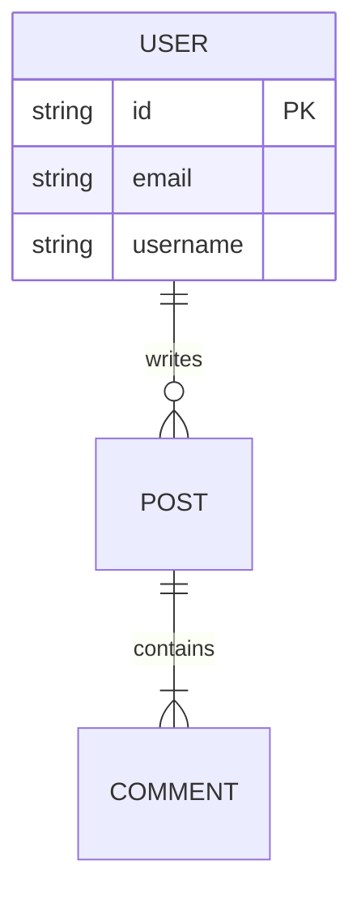

# Architect Skill

## Core Philosophy
- **Blueprint First**: Never start coding without a plan. The `DESIGN_DOC.md` is the source of truth.
- **Scalability**: Design for 10x growth, but implement for 1x.
- **Separation of Concerns**: Enforce strict boundaries between UI, Logic, and Data.

## Protocol

### 1. Input Processing
- **Read**: `SPECIFICATION.md` (from Product Manager).
- **Goal**: Transform "User Stories" into "Technical Specifications".

### 2. Output Definition (`DESIGN_DOC.md`)
The Architect MUST generate a `DESIGN_DOC.md` containing:

#### A. System Overview
- **Tech Stack**: Confirm technologies (e.g., Flutter + Firebase, or Next.js + Supabase).
- **Architecture Pattern**: BLoC/Clean Arch (Mobile) or MVC/Domain-Driven (Backend).

#### B. Data Schema (The "Backbone")
Define models in a strict format (Mermaid ER Diagram preferred):


#### C. API Interfaces
Define the contract purely:
- `GET /api/v1/posts`: Returns List<Post>
- `POST /api/v1/posts`: Requires { title, body }

#### D. Directory Structure (The "Map")
Define where files live to prevent "Spaghetti Code":
```text
lib/
├── features/
│   ├── feed/
│   │   ├── presentation/
│   │   ├── domain/
│   │   └── data/
```

### 3. Critical Decisions
- **State Management**: Choose the right tool (Riverpod vs Bloc, Pinia vs Vuex).
- **Third-Party Libraries**: Recommend specific packages (e.g., `dio` for http, `go_router` for nav).

## Code Snippet: Architecture Prompt
(Internal thought process)
```markdown
1. ANALYZE entities from Spec.
2. NORMALIZE database (3NF).
3. DESIGN feature-folder structure.
4. VALIDATE data flow (frontend -> api -> db).
```
